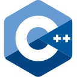

## 👋 Hello!

I am Nick Karydakis, a computer engineer specializing in software, with an interest in robotics, optimization and control, software design, high performance computing, distributed systems and system design.

I hold an Int. Msc. degree in Computer Science and Informatics from the University of Patras.

I currently work as a collaborator at @upatras-lar, a robotics research group at the University of Patras.

## Main Projects Breakdown
Below, you can find a breakdown of my main projects, ordered by field.

### Robotics & Optimization
* [hmpc](https://github.com/notTypecast/hmpc): Thesis project concerning the combination of neural networks with MPC (Model Predictive Control) to improve control performance and efficiency of a 2D and 3D quadrotor.
* [cube_stacking](https://github.com/notTypecast/cube_stacking): Solutions for the cube stacking problem, where the Franka robotic arm needs to stack three cubes in a given order. Includes equivalent C++ and Python implementation.
* [fbc](https://github.com/notTypecast/fbc): A Quadratic-Programming based full-body control library.
* [srbd-nn](https://github.com/notTypecast/srbd_nn): Project similar to _hmpc_, combining residual learning neural networks with the single rigid body dynamics model to improve the model's control performance in an unknown environment.

### System Design
* [LogicSim](https://github.com/notTypecast/LogicSim): A desktop cross-platform visual logic design simulator application, written in C++ and Qt.
* [DiscountShare](https://github.com/notTypecast/DiscountShare): A sample crowd-sourced web-based system for sharing available discounts for stores in a given geographical area.
* [TVOnDemand](https://github.com/graikos/TVOD_DBLab): A sample web-based system for browsing available movies and shows.

### Distributed Systems
* [E-Chord](https://github.com/notTypecast/E-Chord): A Python implementation of the Chord DHT (Distributed Hash Table) protocol, a peer-to-peer lookup service.
* [E-Pastry](https://github.com/graikos/E-Pastry): An equivalent implementation of the Pastry DHT protocol, a peer-to-peer lookup service with different routing techniques to those of the Chord protocol.

### High-Performance Computing & GPUs
* [KNN-hpc](https://github.com/notTypecast/knn_hpc): Various optimizations to significantly improve the performance of the k-nearest-neighbors algorithm, using CPU parallelization techniques. Also includes GPU implementations, using CUDA and OpenACC.

### Main Languages

  
  
  

### Other Languages

  
  
  

### Contact
You can contact me via email at nickkarydakis@gmail.com.
